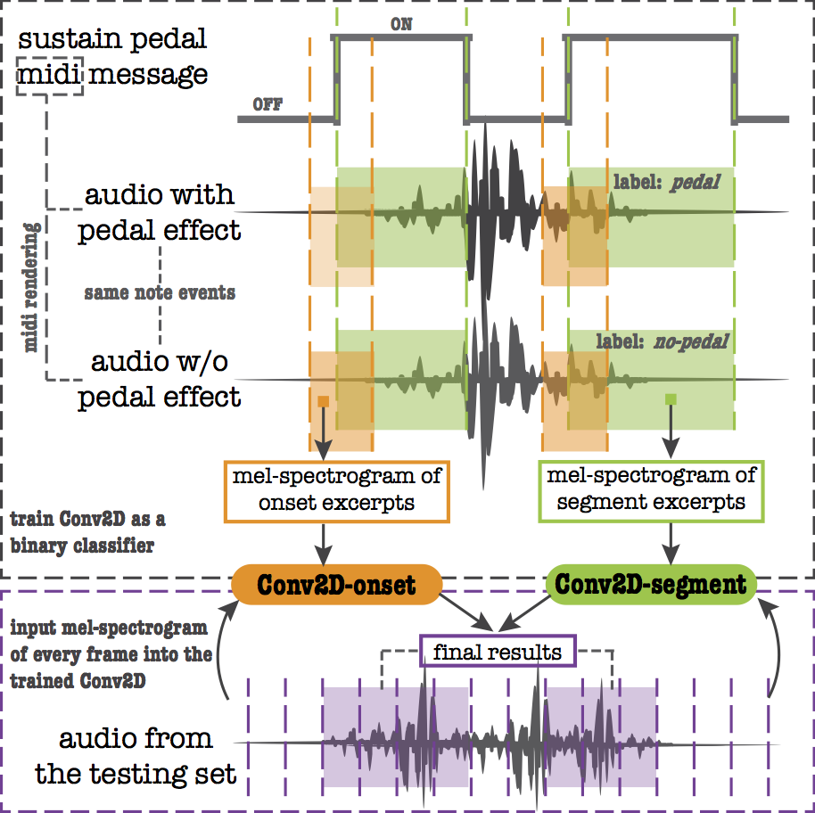
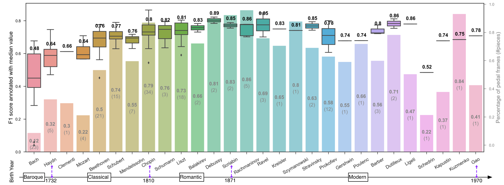

# sustain-pedal-detection

Companion codes for the submission:

Beici Liang, György Fazekas, Mark Sandler. "Piano Sustain-Pedal Detection Using Convolutional Neural Networks".



## Index

* `0. pedal midi info.ipynb`: understand MIDI files and how the ground-truth annotations are extracted

* `1. dataset preparation.ipynb`: how to build the dataset and generate excerpts

* `2.1 pedal onset classification.ipynb`: how to train `Conv2D-onset`

* `2.2 pedal segment classification.ipynb`: how to train `Conv2D-segment`

* `2.3 how mfcc performs on the small dataset.ipynb`: compare with SVM using MFCC features

* `3. piece-wise detection.ipynb`: how to fuse the decision outputs from `Conv2D-onset` and `Conv2D-segment` so as to perform the detection on a piano piece.

Trained models are saved in folder `./save-model`. Evaluation results for every piece in the testing set are saved in 'psegment-testresult_onset98_seg98.csv'.

Box plot of F1 score and bar plot of pedal-frame proportion ordered by composer's lifetime:


- 

## Requirements

Codes are based on the following settings and their corresponding versions. 

Setting | Version
------------ | -------------
OS | Centos 7.3
GPU | Titan Xp
module | cuda/8.0-cudnn5.1
Python | 2.7.5

Python dependencies can be installed by
```
pip install -r requirements.txt
```

You need to install [Jupyter Notebook](http://jupyter.org/) to run `.ipynb` in your local browser.